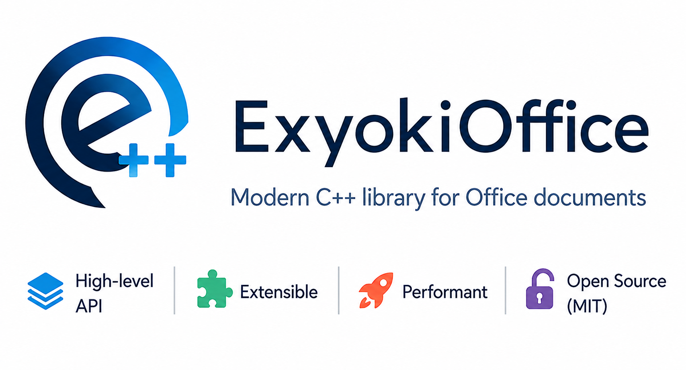

# ExyokiOffice



ExyokiOffice is a C++20 shared library for creating, opening, editing, and
saving Microsoft Office Open XML packages (`.docx`, `.xlsx`, `.pptx`). It
writes the ZIP/XML package directly — Microsoft Office is not a build or
runtime dependency.

The library has four layers:

- **High-level editing APIs** — friendly, typed APIs for authoring Word,
  Excel, and PowerPoint documents:
  - `ExyokiOffice::Word::WordDocumentEditor` — paragraphs, formatting,
    headings, lists, tables, images, hyperlinks, headers/footers, sections,
    fields, footnotes, comments, tracked revisions, and mail-merge. See the
    [Word quickstart](docs/Word.md).
  - `ExyokiOffice::Excel::ExcelDocumentEditor` — worksheets, cells,
    ranges, formulas, styles, tables, data validation, conditional
    formatting, and structural row/column edits. See the
    [Excel quickstart](docs/Excel.md).
  - `ExyokiOffice::PowerPoint::PowerPointDocumentEditor` — slides, shapes,
    text, pictures, media, DrawingML tables, transitions, animations,
    masters/layouts/placeholders, and speaker notes. See the
    [PowerPoint quickstart](docs/PowerPoint.md).
- **Typed OpenXML DOM** (`ExyokiOffice::DocumentFormat::OpenXml::…`) —
  generated element classes for WordprocessingML, SpreadsheetML, and
  PresentationML.
- **Packaging layer** (`ExyokiOffice::Packaging::…`) — OPC package parts,
  relationships, content types, and document lifecycle.
- **Tooling and front ends** — everything built on top of the three layers
  above: `ExyokiOffice::Tools` (validation, inspection, conversion, diffing,
  text and media extraction) and `ExyokiOffice::Xml` (namespace-precise
  XPath 1.0 over any part) for C++ callers, the **`exyoki`** command line for
  a shell or a script, and three **MCP servers** that hand the editors to an
  AI agent as typed tools. See the [exyoki guide](docs/tools/exyoki.md) and
  the [MCP servers guide](docs/tools/mcp-servers.md).

## Find the right API

| Task | Start with | Documentation | Example |
| --- | --- | --- | --- |
| Create or edit Word documents | `Word::WordDocumentEditor` | [Word guide](docs/Word.md) | [ExampleWordEditor](examples/ExampleWordEditor/main.cpp) |
| Modify an existing Word document | `WordDocumentEditor::Open` and body cursors | [Word documents](docs/word/documents.md), [text](docs/word/text.md) | [ExampleWordEdit](examples/ExampleWordEdit/main.cpp) |
| Create or edit Excel workbooks | `Excel::ExcelDocumentEditor` | [Excel guide](docs/Excel.md) | [ExampleExcelEditor](examples/ExampleExcelEditor/main.cpp) |
| Create or edit PowerPoint presentations | `PowerPoint::PowerPointDocumentEditor` | [PowerPoint guide](docs/PowerPoint.md) | [ExamplePowerPointEditor](examples/ExamplePowerPointEditor/main.cpp) |
| Manipulate typed OpenXML elements or package parts | Typed DOM and `ExyokiOffice::Packaging` | [Architecture](docs/introduction.md) | [ExampleWord](examples/ExampleWord/main.cpp) |
| Inspect, validate, convert, diff, or query packages | `ExyokiOffice::Tools`, `ExyokiOffice::Xml`, or `exyoki` | [exyoki guide](docs/tools/exyoki.md) | [exyoki](tools/exyoki/main.cpp) |
| Let an AI agent edit documents | The `exyoki-mcp-*` MCP servers | [MCP servers](docs/tools/mcp-servers.md) | [exyoki-mcp-word](tools/mcp/word/main.cpp) |
| Work on generated OpenXML code | Generator under `gen/` | [Generator guide](gen/README.md), [metadata guide](data/README.md) | Generator tests under `tests/unit/` |

Use the high-level editor whenever it models the feature. Drop to the typed DOM
or packaging layer only when lower-level control is required.

Which file formats and Office versions are supported, and how far the API goes
for each feature area — create, edit, or preserve — is tabulated in the
[compatibility matrix](docs/Compatibility.md).

The fourth layer's command line, **`exyoki`**, is a utility for
inspecting, validating, converting, unpacking/repacking, and editing packages
from the shell or a script (`commands`, `parts`, `relationships`, `info`,
`validate`, `signatures`, `unpack`, `pack`, `to-flat-opc`, `from-flat-opc`,
`convert`, `export-media`, `dedup`, `search`, `query`, `extract-text`, `stat`,
`replace`, `split`, `merge`, `diff`, `compare`, `redact`, `fill`, `recalc`,
`external`, `props get/set`, `schema`, `completions`), backed by the reusable
`ExyokiOffice::Tools` library module. The `convert` command turns
Word/Excel/PowerPoint packages into AI/automation-friendly formats — Markdown,
JSON, plain text, semantic XML, and CSV for workbooks — and back; `search` and
`replace` work across all three families; `redact` scrubs comments, tracked
revisions, hidden text and identity metadata before publication; `fill` runs a
JSON-driven mail merge; `recalc` recomputes workbook formulas; the `query`
command runs namespace-precise XPath 1.0 over any part (backed by the
`ExyokiOffice::Xml` dynamic-query layer); `exyoki commands --format json`
describes the whole interface — every command, option, value constraint and
exit code — so a script or an agent can discover it without parsing `--help`,
and `exyoki schema` does the same for the data: it prints the
[JSON Schema](docs/schemas/exyokioffice-document-v1.schema.json) of the
`convert` envelope, and `exyoki schema --check` validates a generated
document against it before it is imported. See the
[exyoki guide](docs/tools/exyoki.md).

Every guide referenced above lives in [docs/](docs/README.md), which indexes the
complete user manual: a general introduction, a quickstart plus a folder of
chapters for each format (`docs/word/`, `docs/excel/`, `docs/powerpoint/`),
digital signatures, external resources, `exyoki` and its conversion formats,
the MCP servers, the [compatibility matrix](docs/Compatibility.md), and the
project's versioning, CI, and fuzzing policies.

The OpenXML schema/part metadata under `data/` (consumed by the code
generator, see below) is taken from Microsoft's
[Open-XML-SDK](https://github.com/dotnet/Open-XML-SDK/tree/main/data), which
is a .NET/C# library. ExyokiOffice is an independent, from-scratch
implementation for C++ — it shares no code with Open-XML-SDK. What it adds on
top of that shared schema metadata is the subject of the next section.

## Why ExyokiOffice

There are many ways to write a `.docx`. ExyokiOffice occupies one position
that nothing else does: **a native C++ library covering all three OOXML
families with both a friendly editing API and a typed schema DOM, which
treats content it does not model as data to preserve rather than data to
drop.**

| | ExyokiOffice | Open XML SDK | Apache POI | python-docx / openpyxl / python-pptx | OpenXLSX / xlnt / libxlsxwriter |
| --- | --- | --- | --- | --- | --- |
| Language | C++20 | C# / .NET | Java | Python | C++ / C |
| Runtime dependency | none | .NET | JVM | CPython | none |
| Word / Excel / PowerPoint | all three | all three | all three | three separate projects | Excel only |
| High-level editing API | yes | no — typed DOM only | yes | yes | yes |
| Typed schema DOM | yes | yes | yes | no | no |
| Schema and semantic validation | yes | yes | no | no | no |
| Command-line front end | `exyoki` | no | no | no | no |
| MCP servers for AI agents | three | no | no | no | no |
| Rendering, PDF export | no | no | no | no | no |
| License | MIT | MIT | Apache-2.0 | MIT / MIT / MIT | MIT / MIT / BSD-2 |

Two things follow from that table and are worth stating plainly.

**What is unusual here.** Preservation is a tested contract, not an
aspiration: [docs/Compatibility.md](docs/Compatibility.md) grades every
feature area on create, edit, *and* preserve, and `tests/compat/` has one
test per row that requires an open-save cycle to return the package byte for
byte. On top of that sit a command line and three MCP servers built from the
same library, so the same capabilities are available to a shell script and to
an AI agent without a second implementation.

**What it will never do.** No rendering, no layout, no PDF or image export,
no legacy `.doc`/`.xls`/`.ppt`, no ODF/RTF/HTML, no encrypted packages, and
no ISO 29500 Strict. Those are permanent boundaries, listed under
[Out of scope](docs/Compatibility.md#out-of-scope). A project that needs a
PDF at the end of its pipeline needs a renderer as well as this library.

The full comparison — against Open XML SDK, Apache POI, the Python
libraries, the single-format C++ libraries, the commercial suites, embedded
office suites, and the other Office MCP servers, with a "choose them
instead when…" for each — is
[How ExyokiOffice compares](docs/comparison.md).

## Quick start

### Word

```cpp
#include "ExyokiOffice/Word/WordDocument.hpp"

int main()
{
    using namespace ExyokiOffice::Word;

    auto editor = WordDocumentEditor::CreateNew();
    editor->AddHeading("Hello world");
    editor->AddParagraph("This document was created by ExyokiOffice.");
    editor->SaveToFile("Hello.docx");
}
```

For a complete tour — run formatting, custom styles, bulleted and multi-level
numbered lists, a merged and shaded table, images with alt text, hyperlinks and
bookmarks, footnotes, endnotes, comments, content controls, page fields in the
footer, page setup, and a template-style search and replace — see
[examples/ExampleWordEditor/main.cpp](examples/ExampleWordEditor/main.cpp)
and the [Word quickstart](docs/Word.md). Editing a document that already exists —
opening it, filling placeholders, and inserting content next to what is already
there — is [examples/ExampleWordEdit/main.cpp](examples/ExampleWordEdit/main.cpp).
The low-level DOM path is shown in
[examples/ExampleWord/main.cpp](examples/ExampleWord/main.cpp).

### Excel

```cpp
#include "ExyokiOffice/Excel/ExcelDocument.hpp"

int main()
{
    using namespace ExyokiOffice::Excel;

    auto editor = ExcelDocumentEditor::CreateNew();
    auto sheet = editor->FirstWorksheet();
    sheet->SetCellText(1, 1, "Hello world");
    sheet->SetCellText(2, 1, "This workbook was created by ExyokiOffice.");
    editor->SaveToFile("Hello.xlsx");
}
```

For a complete tour — two worksheets, styled headers, number formats, formulas
computed by the built-in formula engine, a named range, a chart, a worksheet
table with a slicer, data validation, conditional formatting, frozen panes,
print setup, hyperlinks, and comments — see
[examples/ExampleExcelEditor/main.cpp](examples/ExampleExcelEditor/main.cpp)
and the [Excel quickstart](docs/Excel.md).

### PowerPoint

```cpp
#include "ExyokiOffice/PowerPoint/PowerPointDocument.hpp"

int main()
{
    using namespace ExyokiOffice::PowerPoint;
    namespace Drawing = ExyokiOffice::DocumentFormat::OpenXml::Drawing;
    namespace Presentation = ExyokiOffice::DocumentFormat::OpenXml::Presentation;

    using ExyokiOffice::MeasurementUnit;
    using ExyokiOffice::MeasuringUnits;
    const auto Inches = [](double value) { return MeasuringUnits(value, MeasurementUnit::Inch); };

    auto editor = PowerPointDocumentEditor::CreateNew();
    editor->SetSlideSize(PresentationSlideSize::Widescreen16x9());

    // Every slide needs a layout, and every layout a master.
    auto master = editor->AddSlideMaster("Default");
    auto layout = editor->AddSlideLayout(master, "Title", Presentation::SlideLayoutValues::Title);

    auto shape = editor->AddSlide()->ShapeTree()->AddShape("Title");
    editor->SetSlideLayout(0, layout);
    shape->SetPresetGeometry(Drawing::ShapeTypeValues::Rectangle);
    shape->SetTransform({.Position = {Inches(0.75), Inches(2.5)},
                         .Size = {Inches(11.833), Inches(1.3)}});

    PresentationTextRun run;
    run.Text = "Hello world";
    run.Language = "en-US";
    run.Bold = true;

    PresentationTextFrame frame;
    frame.Paragraphs = {PresentationTextParagraph{.Runs = {run}}};
    shape->SetTextFrame(frame);

    editor->SaveToFile("Hello.pptx");
}
```

For a complete tour — slide size and properties, a `SlideBuilder` title slide,
formatted multi-level text, shape fills, outlines and effects, a picture, a
chart, a DrawingML table with a merged cell, a transition, animation effects,
speaker notes, comments, sections, and a custom show — see
[examples/ExamplePowerPointEditor/main.cpp](examples/ExamplePowerPointEditor/main.cpp)
and the [PowerPoint quickstart](docs/PowerPoint.md).

### Examples

| Example | Layer | What it shows |
| --- | --- | --- |
| [ExampleWordEditor](examples/ExampleWordEditor/main.cpp) | `WordDocumentEditor` | A complete report authored from scratch: styles, body cursors, lists, tables, images, notes, comments, fields, page setup, find and replace. |
| [ExampleWordEdit](examples/ExampleWordEdit/main.cpp) | `WordDocumentEditor` | Editing a document that already exists: open, read, fill placeholders that span runs, insert next to existing blocks, extend a table, save under a new name. |
| [ExampleExcelEditor](examples/ExampleExcelEditor/main.cpp) | `ExcelDocumentEditor` | A two-sheet workbook: styled data, formulas and recalculation, named range, cross-sheet chart, table, slicer, validation, printing. |
| [ExamplePowerPointEditor](examples/ExamplePowerPointEditor/main.cpp) | `PowerPointDocumentEditor` | A five-slide deck: slide size, title placeholder, text, picture, chart, table, transition, animations, notes, comments, sections. |
| [ExampleWord](examples/ExampleWord/main.cpp) | Typed DOM + packaging | A smaller `.docx` built element by element, with no editor in the way: a styles part, paragraph properties, a table, section properties. |

Every example saves its document and then re-opens it, so running one is also a
round-trip check — and each one is registered with CTest whenever the unit tests
are enabled, so a broken example fails the test suite instead of rotting. The editor examples stay on the public
high-level API: they never create or edit a generated DOM element, and the only
generated types they name are the enums that API takes as arguments (alignment,
preset shape, border style, and so on).

## MCP servers

Three Model Context Protocol servers — `exyoki-mcp-word`, `exyoki-mcp-excel`,
and `exyoki-mcp-power-point` — expose the same editing power to AI agents as
typed tools over stdio. An agent opens a document, edits it through named tools
with published JSON schemas, validates the result, and saves it; there is no
code-execution escape hatch, and every path is confined to a configured
workspace.

```jsonc
// .mcp.json
{
  "mcpServers": {
    "word": {
      "command": "C:/ExyokiOffice/bin/exyoki-mcp-word.exe",
      "args": ["--workspace", "C:/Users/me/Documents/agentwork"]
    }
  }
}
```

See the [MCP servers guide](docs/tools/mcp-servers.md) for registration in
Claude Code, Claude Desktop, VS Code, and Cursor, the security model, and the
tool catalog of each server.

A distroless [container image](docs/tools/docker.md) carries the library,
`exyoki` and all three servers, so `"command": "docker"` works instead and
nothing has to be installed on the machine:

```jsonc
{
  "mcpServers": {
    "word": {
      "command": "docker",
      "args": ["run", "--rm", "-i",
               "-v", "/path/to/documents:/work",
               "exyokioffice:1.0.0", "word"]
    }
  }
}
```

## Building

The library needs a C++20 compiler — MSVC, Clang, or GCC — and CMake 3.25 or
newer. Build through the presets in `CMakePresets.json` rather than ad-hoc
source and build directories, so the generator, compiler, options, and binary
directory stay consistent.

On **Windows**, `WinBuild.ps1` locates the newest Visual Studio installation
with `vswhere`, enters its developer environment, and drives the presets for
you:

```powershell
.\WinBuild.ps1 -Clean -Test
```

`-Configuration` defaults to `RelWithDebInfo`. Pass `-Configuration Debug` for
MSVC's iterator debugging and an unoptimized debugger view; the sources carry no
runtime assertions, so that is all a debug build adds, and it runs the test
suite in about eleven minutes instead of two.

To build and install the library and `exyoki` into `build/install` (or a
custom prefix), use:

```powershell
.\WinBuild.ps1 -Configuration RelWithDebInfo -Install
.\WinBuild.ps1 -Configuration RelWithDebInfo -Install -InstallPrefix C:\ExyokiOffice
```

On **Linux**, use the presets directly:

```bash
cmake --preset linux-ninja-debug
cmake --build --preset linux-ninja-debug
ctest --preset linux-ninja-debug
```

### CMake presets

Every preset carries a `condition` on the host system, and the condition is
inherited, so `cmake --list-presets` shows only the presets that apply to the
machine you are on — the `linux-*` presets are invisible on Windows and the
`windows-*` presets on Linux.

| Configure preset | Host | Toolchain | Binary directory |
| --- | --- | --- | --- |
| `windows-vs` | Windows | Visual Studio 2026 (v18), multi-config | `build/vs` |
| `windows-ninja-debug` / `windows-ninja-release` | Windows | Ninja + MSVC | `build/ninja-debug` / `build/ninja-release` |
| `windows-ninja-clang-debug` / `windows-ninja-clang-release` | Windows | Ninja + `clang-cl` | `build/ninja-clang-debug` / `build/ninja-clang-release` |
| `windows-vs-asan` / `windows-ninja-asan` | Windows | AddressSanitizer | `build/vs-asan` / `build/ninja-asan` |
| `windows-ninja-clang-fuzz` / `windows-ninja-fuzz` | Windows | libFuzzer + ASan, static library | `build/ninja-clang-fuzz` / `build/ninja-fuzz` |
| `linux-ninja-debug` / `linux-ninja-release` | Linux | Ninja + the system default compiler (usually GCC) | `build/linux-ninja-debug` / `build/linux-ninja-release` |
| `linux-ninja-clang-debug` / `linux-ninja-clang-release` | Linux | Ninja + Clang | `build/linux-ninja-clang-debug` / `build/linux-ninja-clang-release` |
| `linux-ninja-asan` | Linux | Ninja + Clang, ASan + UBSan | `build/linux-ninja-asan` |

Build and test presets reuse the configure preset's name (`linux-ninja-debug`,
`ninja-release`, …); the multi-config `windows-vs` preset is driven by the
`debug` / `release` build presets and `windows-vs-asan` by `asan-debug` /
`asan-release`. The `*-release` presets configure **`RelWithDebInfo`**, not
`Release`. Every non-fuzz preset already turns on the examples, the unit tests,
and `exyoki`, so the option table below matters only for builds configured
without a preset.

Nothing depends on the presets. They are a recorded set of known-good
configurations, not a supported-configuration list — a plain
`cmake -S . -B <dir>` with your own generator, compiler, toolchain file, or
options builds the library the same way, and consumers of the installed package
never see them at all.

The Ninja presets parallelize on their own; the Visual Studio generator needs
`--parallel <n>` (`WinBuild.ps1` passes it, along with MSVC's `/MP`). The
generated DOM translation units are large, so a clean build is slow and each
compiler process wants roughly 1.5–2 GB — cap the job count on memory-limited
machines and containers rather than on core count.

### CMake options

| Option | Default | Description |
| --- | --- | --- |
| `EXYOKIOFFICE_BUILD_EXAMPLE_WORD` | `ON` | Build the low-level `ExampleWord` sample. |
| `EXYOKIOFFICE_BUILD_EXAMPLE_WORD_EDITOR` | `ON` | Build the high-level `ExampleWordEditor` sample. |
| `EXYOKIOFFICE_BUILD_EXAMPLE_WORD_EDIT` | `ON` | Build the `ExampleWordEdit` sample (editing an existing document). |
| `EXYOKIOFFICE_BUILD_EXAMPLE_EXCEL_EDITOR` | `ON` | Build the high-level `ExampleExcelEditor` sample. |
| `EXYOKIOFFICE_BUILD_EXAMPLE_POWERPOINT_EDITOR` | `ON` | Build the high-level `ExamplePowerPointEditor` sample. |
| `EXYOKIOFFICE_BUILD_UNIT_TESTS` | `OFF` | Build the doctest-based unit tests and register them with CTest. |
| `EXYOKIOFFICE_BUILD_TOOL` | `ON` | Build the `exyoki` command-line utility. |
| `EXYOKIOFFICE_BUILD_MCP` | `ON` | Build the three Model Context Protocol servers. |
| `EXYOKIOFFICE_RUN_GENERATOR` | `ON` | Run `OpenXmlGenerator` during the build and refresh the committed generated sources. |
| `EXYOKIOFFICE_DUMP_EXPORTS` | `OFF` | Generate a demangled export list (Windows only). |
| `BUILD_SHARED_LIBS` | `ON` | Standard CMake switch; `OFF` builds the library as a static archive. |

The generated DOM sources are committed, so `EXYOKIOFFICE_RUN_GENERATOR=OFF`
builds from them as they are. Two kinds of build want that: a packaging build,
which must not write into the source tree it was handed, and a cross build,
which cannot run a generator it just compiled for the target architecture. The
vcpkg port sets it, and so should anything else building for a different machine.

### Running the tests

The presets enable `EXYOKIOFFICE_BUILD_UNIT_TESTS`, so every test layer and
every example is registered with CTest:

```powershell
.\WinBuild.ps1 -Test    # Windows
```

```bash
ctest --preset linux-ninja-debug             # Linux, after building
```

The suite is split into layers, one doctest executable each, and each layer is
registered as several CTest entries carrying labels. That makes it cheap to run
only what a change touches:

```powershell
ctest --preset debug -L word          # everything Word, including the examples
ctest --preset debug -L excel-pivot   # just the pivot-table tests
ctest --preset debug -L compat        # the compatibility matrix
ctest --preset debug --print-labels   # every label there is
```

The labels are the same ones the rows of
[docs/Compatibility.md](docs/Compatibility.md) cite, so a claim in that matrix
and the tests behind it are one command apart.

Every entry is its own process, so the suite runs in parallel. The test presets
ask for that by default and `.\WinBuild.ps1 -Test` raises the level to the
machine's core count; `ctest --preset debug --parallel <n>` overrides it.

### Installing and consuming

Install a configured build into a chosen prefix — the path is the preset's
binary directory:

```powershell
cmake --install build/ninja-release --prefix C:/ExyokiOffice
```

```bash
cmake --install build/linux-ninja-release --prefix /opt/ExyokiOffice
```

Consume the installed package from another CMake project:

```cmake
find_package(ExyokiOffice 1.0 CONFIG REQUIRED)
target_link_libraries(MyApplication PRIVATE ExyokiOffice::ExyokiOffice)
```

Set `CMAKE_PREFIX_PATH` to the installation prefix when it is outside CMake's
standard search locations. The installed package contains all public and
generated headers, the shared library, and its CMake target files.

### vcpkg

ExyokiOffice is also packaged for [vcpkg](https://vcpkg.io):

```powershell
vcpkg install exyokioffice
```

The `exyoki` command-line utility and the MCP servers are optional features, so
that consuming the library alone does not build them:

```powershell
vcpkg install "exyokioffice[tools,mcp]"
```

Consuming it is the same `find_package` call as above; the vcpkg toolchain file
puts the package on the search path. The port sources and the consumer smoke
test that exercises them are described in [vcpkg/README.md](vcpkg/README.md).

## Repository layout

| Path | Content |
| --- | --- |
| `include/ExyokiOffice/Word/` | High-level Word editing API (`WordDocumentEditor`). |
| `include/ExyokiOffice/Excel/` | High-level Excel editing API (`ExcelDocumentEditor`). |
| `include/ExyokiOffice/PowerPoint/` | High-level PowerPoint editing API (`PowerPointDocumentEditor`). |
| `include/ExyokiOffice/Packaging/` | OPC package, parts, and document lifecycle. |
| `include/ExyokiOffice/Tools/`, `sources/Tools/` | Package inspection/validation/archiving/Flat-OPC conversion/diff/text-extraction/XML-query module backing `exyoki`. |
| `include/ExyokiOffice/Xml/`, `sources/Xml/` | Dynamic, namespace-precise XPath query layer over the typed DOM (`XmlQuery`, `SelectNodes`, `XmlHelpers`). |
| `include/ExyokiOffice/DOM/`, `sources/DOM/` | Generated typed OpenXML element classes (do not edit by hand). |
| `gen/` | Native source generator that produces the DOM from `data/` metadata. |
| `tools/exyoki/` | `exyoki` CLI executable (CLI11 + nlohmann/json adapters over `ExyokiOffice::Tools`). |
| `tools/mcp/` | The three Model Context Protocol servers for AI agents and the static core they share. |
| `examples/` | Runnable samples. |
| `tests/support/` | Shared test helpers and the single doctest entry point. |
| `tests/unit/`, `tests/dom/` | Core DOM tests; `dom/` holds the generator-emitted per-namespace suites. |
| `tests/package/` | OPC, relationships, shared Office services, security. |
| `tests/word/`, `tests/spreadsheet/`, `tests/presentation/` | One layer per document family. |
| `tests/tools/`, `tests/mcp/`, `tests/generator/` | The `Tools` module, the MCP servers, and the generator's output contract. |
| `tests/compat/` | One test per row of [docs/Compatibility.md](docs/Compatibility.md). |
| `tests/fuzz/` | libFuzzer targets, corpus, and crash artifacts. |
| `vcpkg/` | Consumer smoke test for the vcpkg package and the script that drives it. |

The DOM and some packaging files are generated by the `OpenXmlGenerator`
target from the JSON metadata under `data/`; the root CMake build runs the
generator automatically before compiling the library.

## Third-party libraries

ExyokiOffice is MIT-licensed; every vendored dependency uses a permissive
license that is compatible with MIT — each only requires preserving its
copyright/license notice and imposes no copyleft or additional obligations on
this project or its users.

| Library | Version | License | Used by | Downloaded from | Notes |
| --- | --- | --- | --- | --- | --- |
| [pugixml](https://pugixml.org/) | 1.14 | MIT | `ExyokiOffice` (core library) | [zeux/pugixml, release v1.14](https://github.com/zeux/pugixml/releases/tag/v1.14) | Vendored, lightly patched, under `sources/pugixml/`. Namespaced to `ExyokiOffice::Pugi` via `pugiconfig.hpp`. |
| [kuba--/zip](https://github.com/kuba--/zip) (wrapping [miniz](https://github.com/richgel999/miniz)) | — | MIT (zip); Unlicense, public domain (miniz) | `ExyokiOffice` (core library) | [kuba--/zip](https://github.com/kuba--/zip) (`zip.h`/`zip.c` + bundled `miniz.h`) | Vendored under `sources/zip/`. The vendored sources carry only a warranty disclaimer, so zip's terms are the upstream `LICENSE.txt` as of the version taken; miniz states the Unlicense at the end of `miniz.h` and carries an MIT notice on its compression sections. |
| [doctest](https://github.com/doctest/doctest) | 2.5.0 | MIT | the test layers under `tests/` (test-only) | [doctest/doctest, release v2.5.0](https://github.com/doctest/doctest/releases/tag/v2.5.0) | Vendored header under `3rdparty/doctest/`; not linked into the shipped library, `exyoki`, or the MCP servers. The MCP test layer links their shared static core (`exyoki-mcp-core`) to drive the protocol in-process, which does not put doctest into any installed binary. |
| [CLI11](https://github.com/CLIUtils/CLI11) | 2.5.0 | BSD-3-Clause | `exyoki` and the `exyoki-mcp-*` servers (executables only) | [CLIUtils/CLI11, release v2.5.0](https://github.com/CLIUtils/CLI11/releases/tag/2.5.0) | Single-header amalgamation vendored under `3rdparty/CLI11/`. Used by `tools/exyoki/` and by `tools/mcp/core/ServerRunner.cpp`, which parses the options all three MCP servers share; not part of the public `ExyokiOffice::Tools` API. |
| [nlohmann/json](https://github.com/nlohmann/json) | 3.12.0 | MIT | `ExyokiOffice` (core library), the `exyoki-mcp-*` servers, **and** `OpenXmlGenerator` (build-time code generator) | [nlohmann/json, release v3.12.0](https://github.com/nlohmann/json/releases/tag/v3.12.0) | Single shared header vendored under `3rdparty/nlohmann/`, included as `<nlohmann/json.hpp>`. Used by `sources/Tools/` for `--format json` rendering and for the semantic document envelope; by `tools/mcp/` for everything the servers put on the wire — JSON-RPC 2.0 framing, the published input schema of every tool, and the shared result envelope; and by `gen/src/Json.cpp`/`gen/src/Logger.cpp` to parse the OpenXML metadata under `data/` while generating `include/ExyokiOffice/DOM` / `sources/DOM`. One vendored copy for all consumers — kept at the latest release rather than duplicated at differing versions. It never appears in a public header. |
| [nlohmann/json-schema-validator](https://github.com/pboettch/json-schema-validator) | 2.4.0 | MIT | `ExyokiOffice` (core library) and the `exyoki-mcp-*` servers | [pboettch/json-schema-validator, release 2.4.0](https://github.com/pboettch/json-schema-validator/releases/tag/2.4.0) | Vendored under `3rdparty/json-schema-validator/` (its public header stays at `nlohmann/json-schema.hpp`, matching upstream). Draft-07 validator behind `ExyokiOffice::Tools::ValidateModelJson` and `exyoki schema --check`; also what keeps [the published document-model schema](docs/schemas/exyokioffice-document-v1.schema.json) in step with the serializer in the test suite. The MCP servers validate every tool call against that tool's published input schema before it runs; because the shared library exports none of the validator's symbols, its vendored sources are compiled a second time into `exyoki-mcp-core` instead of being reused from the shared library. Private implementation detail — it appears in no public header. |
| [Open-XML-SDK](https://github.com/dotnet/Open-XML-SDK) data | — | MIT | `OpenXmlGenerator` (build-time input only) | [dotnet/Open-XML-SDK, `data/`](https://github.com/dotnet/Open-XML-SDK/tree/main/data) | Not a library — the schema/part/namespace JSON metadata under `data/` is taken from Microsoft's Open-XML-SDK repository and consumed by the generator to produce the typed DOM. ExyokiOffice itself is an independent C++ implementation and shares no source code with Open-XML-SDK. |

BSD-3-Clause (CLI11) and the Unlicense (miniz) are, like MIT, short permissive
licenses without copyleft; combining or redistributing them alongside
MIT-licensed code is standard practice and does not change the license terms of
ExyokiOffice itself.

Every notice above is reproduced in full in
[THIRD-PARTY-LICENSES.md](THIRD-PARTY-LICENSES.md). In the source tree each one
also sits beside the code it covers: `3rdparty/*/LICENSE*`,
`sources/pugixml/LICENSE`, `sources/zip/LICENSE` and `data/LICENSE`. A binary
package carries them under `share/doc/ExyokiOffice/licenses/`, one file per
component compiled into a shipped binary — which is what BSD-3-Clause requires
of a binary distribution in as many words, and what MIT asks of every
substantial portion.

## License

MIT — see [LICENSE](LICENSE). Third-party notices are in
[THIRD-PARTY-LICENSES.md](THIRD-PARTY-LICENSES.md).
